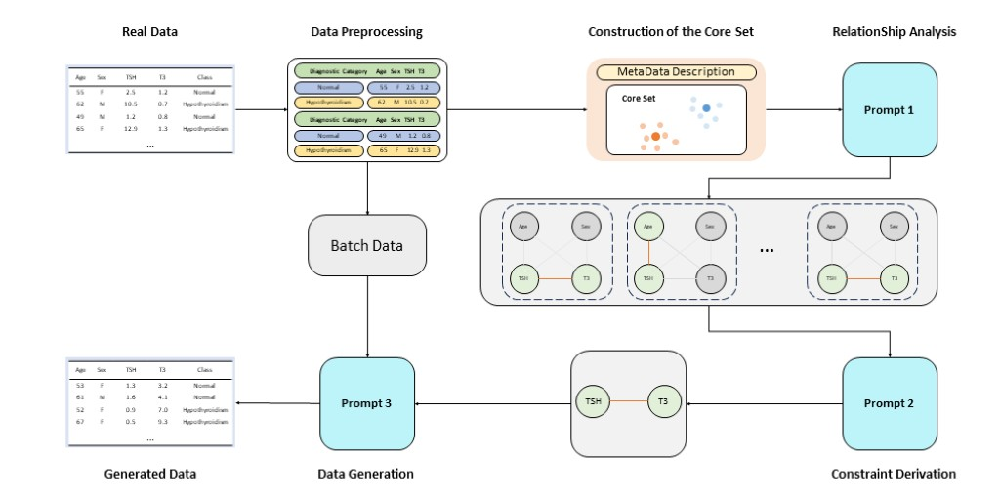

# In-Context Numeric Tabular Data Synthesis with Explicit Attribute-Class Dependency Awareness for Imbalance Classification

This is the repository for **In-Context Numeric Tabular Data Synthesis with Explicit Attribute-Class Dependency Awareness for Imbalance Classification**, a dynamically guided data synthesis mechanism that leverages a hierarchical guidance strategy to optimize LLMs performance in relational data generation tasks.Specifically, our four-stage framework progressively guides the model to produce constraint-compliant, high-fidelity data, with the complete workflow illustrated in Fig. 

<div style="text-align: center;">
    
</div>

## Installation and Environment Setup

* Clone the repository
```shell
git clone https://github.com/colored32/RDDG.git
conda create -n llm python=3.9 -y
conda activate llm
pip install -r requirements.txt
```

## Quick start

### Data Preparation

* The  dataset is available for download at the following [download link](https://drive.google.com/drive/folders/11MV-PEMVLB8xUGUh3kiTEHr1UewmwiQg?usp=drive_link).  

* You need to put the downloaded data directory into the data/realdata directory

### Usage

1. **Configure OpenAI API Key**: Enter your OpenAI API key in `codes/SyntheticDataGeneration/configs.py`:

   ```python
   (line 6) openai_key = "Your-OpenAI-Key"
   ```

2. **Generate Synthetic Datasets**: 

   To generate synthetic datasets using our method, run the following command:

   ```bash
   cd codes/SyntheticDataGeneration
   python generate_samples.py --dataset Sick
   cd ..
   ```

   If you want use other dataset, just modify the '--dataset' in the terminal.For example, use the Travel dataset:
   ```bash
   python generate_samples.py --dataset Travel
   ```

   In `codes/SyntheticDataGeneration/configs.py`, you can also modify the parameters of the corresponding dataset, such as N_batch, initial_prompt, etc.

3. **Train and Evaluate Downstream Task Models**:
   To evaluate the quality of the synthetic data, use the following command:

   ```bash
   cd ../DownstreamTasks
   python Classification.py    
   ```
4. **Change Model to generate Synthetic Datasets**

   ```bash
   <!-- Use Llama3 Model -->
   python generate_samples_Sick_llama3.py --dataset Sick

   <!-- Use Mistral Model-->
   python generate_samples_Sick_mistral.py --dataset Sick
   ```

## Citation

If you find this work or code is helpful in your research, please cite:
```

```
